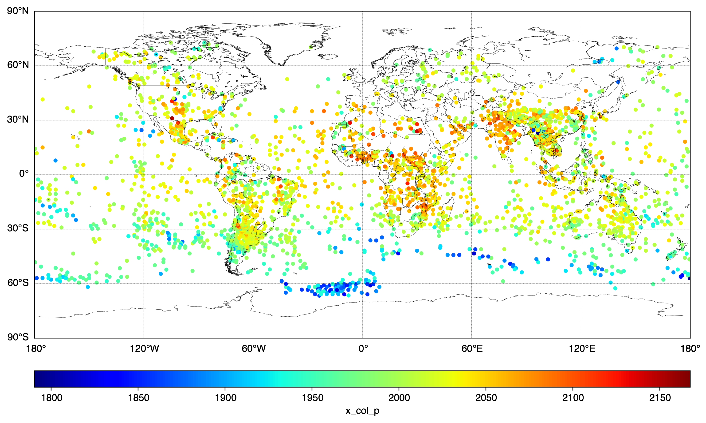
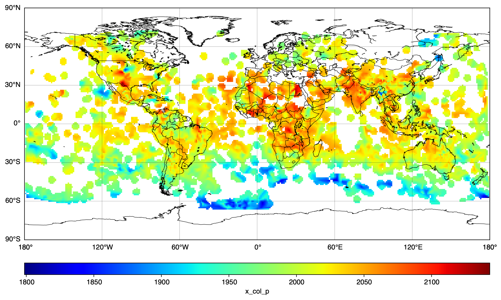
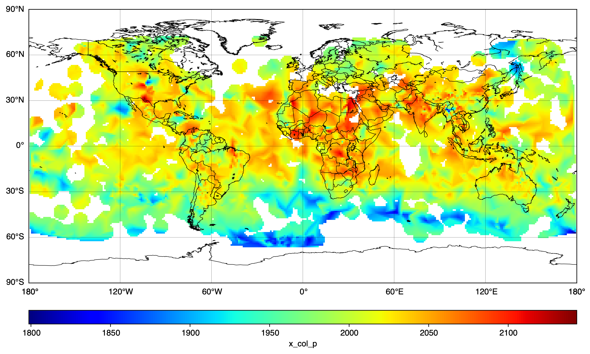

# tropess-plots

Plotting data from TROPESS Level 2 products

[](https://zenodo.org/badge/latestdoi/644506221)

## Setup

See [Setup](./docs/setup.md)

## Data Access

See [Data Access](./docs/data-access.md)

## Browse products

Browse TROPESS products:

```bash
open https://disc.gsfc.nasa.gov/datasets?keywords=tropess
```

To see all the available data for Methane (CH4) go to the Online Archive for CH4:

```bash
open https://tropess.gesdisc.eosdis.nasa.gov/data/TROPESS_Summary/TRPSYL2CH4CRS1FS.1
```

## Download the sample data

For this exercise, download the TROPESS Summary Methane (CH4) product for May 16, 2023:

```bash
data_file=TROPESS_CrIS-JPSS1_L2_Summary_CH4_20230516_MUSES_R1p20_FS_F0p6.nc

pushd ./data

# download the data file
wget --load-cookies ~/.urs_cookies --save-cookies ~/.urs_cookies \
     --auth-no-challenge=on --keep-session-cookies --content-disposition \
     https://tropess.gesdisc.eosdis.nasa.gov/data/TROPESS_Summary/TRPSYL2CH4CRS1FS.1/2023/$data_file

# download the user guide
user_guide=TROPESS-CH4_L2_Product_Quick_Start_User_Guide_Summary_only.pdf
wget --load-cookies ~/.urs_cookies --save-cookies ~/.urs_cookies \
     --auth-no-challenge=on --keep-session-cookies --content-disposition \
https://docserver.gesdisc.eosdis.nasa.gov/public/project/TROPESS/User_Guides/$user_guide

popd     
```

## Run

Configure the project:

```bash
source configure.sh
```
Run `main.py`:

```bash
python3 main.py
```

## Updating the code

```bash
source configure.sh
```

Open the project directory in Visual Studio Code:

```bash
code .
```

## Examples

Bias corrected column-averaged dry air mixing ratio of Methane for the column from 826 hPa to Top of Atmosphere (TOA) in ppbv. 

The scatter plot is a direct plot of the data values.

The spacially interpolated plots use SciPy cKDTree with a maximum distance to preserve large areas where there is no data. 

### Scatter Plot



### Spacial interpolation (3 degrees distance)



### Spacial interpolation (4 degrees distance)


### Spacial interpolation (5 degrees distance)



## Citing this code

Plotting data from TROPESS Level 2 products. 

2023, V. Kantchev, Swift Software Group

https://doi.org/10.5281/zenodo.7963481

